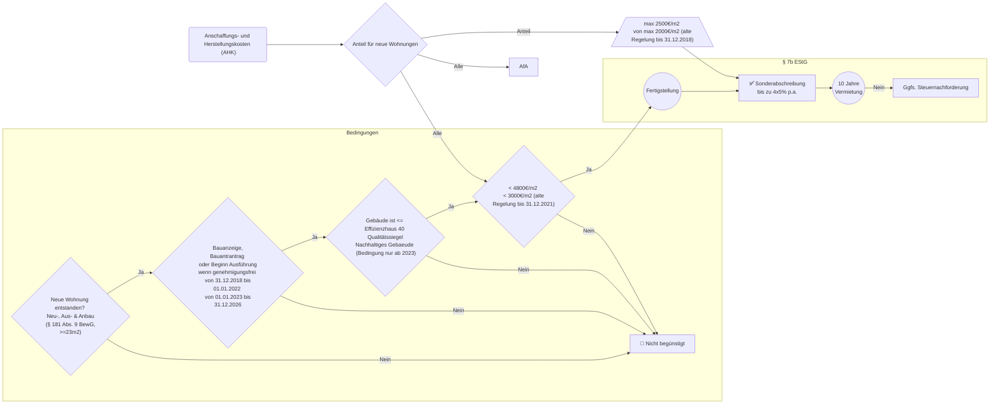

# steuerFlow

Ein paar Mermaid-Flussdiagramme für Steuerzahler.

> [!NOTE]
> Keine Steuer- oder Rechtsberatung.
> Keine Haftung für den Inhalt.

Verbesserungen (Pull Requests, Issues) sind herzlich Willkommen!

## Sonderabschreibungen

### Sonderabschreibung für Mietwohnungsneubau § 7b EStG

Gerechnet wird jeweils €/m2 Wohnfläche (nach Wohnflächenverordnung zzgl. Nebenräume).

Quellen:

- [Gesetzestext](https://www.gesetze-im-internet.de/estg/__7b.html)
- [BMF Anwendungsschreiben zur Sonderabschreibung](https://www.bundesfinanzministerium.de/Content/DE/Downloads/BMF_Schreiben/Steuerarten/Einkommensteuer/2020-07-07-anwendungsschreiben-zur-sonderabschreibung-fuer-die-anschaffung-oder-herstellung-neuer-mietwohnungen-nach-paragraf-7b.pdf?__blob=publicationFile&v=1)

### Investitionsabzugsbetrag und Sonderabschreibung nach § 7g EStG

Quellen:

- [Gesetzestext](https://www.gesetze-im-internet.de/estg/__7g.html)
- [BMF Anwendungsschreiben zu Investitionsabzugsbeträgen](https://www.bundesfinanzministerium.de/Content/DE/Downloads/BMF_Schreiben/Steuerarten/Einkommensteuer/2022-06-15-Zweifelsfragen-Investitionsabzugsbetraege.pdf?__blob=publicationFile&v=2)
- [IHK Stuttgart](https://www.ihk.de/stuttgart/fuer-unternehmen/recht-und-steuern/steuerrecht/einkommen-und-koerperschaftssteuer/ansparabschreibung-676416)
