# steuerFlow

Ein paar Mermaid-Flussdiagramme für Steuerzahler.

> [!NOTE]
> Keine Steuer- oder Rechtsberatung.
> Kein Gewähr.

Verbesserungen (Pull Requests, Issues) sind herzlich Willkommen!

## Sonderabschreibungen

### Investitionsabzugsbetrag und Sonderabschreibung nach § 7g EStG

```mermaid
flowchart LR
    istKMU{"Gewinn < 200.000€ \n (Wirtschaftsjahr des Abzugs)"};
    istKMU -- Ja --> istAktiv;
    id["This 🚫 Unicode"]
```

```mermaid
graph LR;
  subgraph Bedingungen;
    direction TB;
    istKMU{"Gewinn < 200.000€ \n (Wirtschaftsjahr des Abzugs)"};
    istKMU -- Nein --> keineSA["🚫 Nicht begünstigt"];
    istKMU -- Ja --> istAktiv;
    istAktiv{"Aktives Unternehmen \n (Werbende Teilnahme \n am Geschäftsverkehr)?"};
    istAktiv -- Nein --> keineSA;
    istAktiv -- Ja --> istBeweg;
    istBeweg{"Bewegliches Wirtschaftsgut? \n (Abnutzbar, Selbständig, Aktiviert)"};
    istBeweg -- Nein --> keineSA;
    istBeweg -- Ja --> ist90;
    ist90{"Betriebliche \n Nutzung > 90%? \n (In inländischer Betriebsstätte)"};
    ist90 -- Nein --> keineSA;
  end;
  subgraph EStG7g ["§ 7g EStG"];
    direction TB;
    ist90 -- Ja --> statusInv;
    statusInv{"Status \n der Investition?"};
    statusInv -- erfolgt --> 7gSonder;
  end;
```

Quellen:

- [Gesetzestext](https://www.gesetze-im-internet.de/estg/__7g.html)
- [BMF Anwendungsschreiben zu Investitionsabzugsbeträgen](https://www.bundesfinanzministerium.de/Content/DE/Downloads/BMF_Schreiben/Steuerarten/Einkommensteuer/2022-06-15-Zweifelsfragen-Investitionsabzugsbetraege.pdf?__blob=publicationFile&v=2)
- [IHK Stuttgart](https://www.ihk.de/stuttgart/fuer-unternehmen/recht-und-steuern/steuerrecht/einkommen-und-koerperschaftssteuer/ansparabschreibung-676416)
