# steuerFlow

Ein paar Mermaid-Flussdiagramme für Steuerzahler.

> [!NOTE]
> Keine Steuer- oder Rechtsberatung.
> Keine Haftung für den Inhalt.

Verbesserungen (Pull Requests, Issues) sind herzlich Willkommen!

## Sonderabschreibungen

### Sonderabschreibung für Mietwohnungsneubau § 7b EStG

Gerechnet wird jeweils €/m2 Wohnfläche (nach Wohnflächenverordnung zzgl. Nebenräume).

Quellen:

- [Gesetzestext](https://www.gesetze-im-internet.de/estg/__7b.html)
- [BMF Anwendungsschreiben zur Sonderabschreibung](https://www.bundesfinanzministerium.de/Content/DE/Downloads/BMF_Schreiben/Steuerarten/Einkommensteuer/2020-07-07-anwendungsschreiben-zur-sonderabschreibung-fuer-die-anschaffung-oder-herstellung-neuer-mietwohnungen-nach-paragraf-7b.pdf?__blob=publicationFile&v=1)

### Investitionsabzugsbetrag und Sonderabschreibung nach § 7g EStG

```mermaid
graph LR;
  subgraph Bedingungen;
    direction TB;
    istKMU{"Gewinn < 200.000€ \n (Wirtschaftsjahr des Abzugs)"};
    istKMU -- Nein --> keineSA["🚫 Nicht begünstigt"];
    istKMU -- Ja --> istAktiv;
    istAktiv{"Aktives Unternehmen \n (Werbende Teilnahme \n am Geschäftsverkehr)?"};
    istAktiv -- Nein --> keineSA;
    istAktiv -- Ja --> istBeweg;
    istBeweg{"Bewegliches Wirtschaftsgut? \n (Abnutzbar, Selbständig, Aktiviert)"};
    istBeweg -- Nein --> keineSA;
    istBeweg -- Ja --> ist90;
    ist90{"Betriebliche \n Nutzung > 90%? \n (In inländischer Betriebsstätte)"};
    ist90 -- Nein --> keineSA;
  end;
  subgraph EStG7g ["§ 7g EStG"];
    direction TB;
    ist90 -- Ja --> statusInv;
    statusInv{"Status \n der Investition?"};
    statusInv -- erfolgt --> 7gSonder;
    7gSonder["✅ Sonderabschreibung \n <20% innerhalb von bis zu 4 Jahren \n (zusätzlich zu AfA)"];
    statusInv -- geplant --> 7gInvAbzug;
    7gInvAbzug["✅ Investitionsabzugsbetrag \n 50% der erwarteten AHK "];
    7gInvAbzug -- "erfolgt (🗓️ 3 Jahre)" --> 7gInvAbzugErfolg;
    7gInvAbzugErfolg["🔄 Hinzurechnung ➕50% AHK zum Gewinn, \n Sonderabschreibung ➖50% AHK"];
    7gInvAbzugRueckz["Ggfs. Steuernachforderung zzgl. 1.8% p.a."];
    7gInvAbzug -- nicht erfolgt --> 7gInvAbzugRueckz;
  end;
```

Quellen:

- [Gesetzestext](https://www.gesetze-im-internet.de/estg/__7g.html)
- [BMF Anwendungsschreiben zu Investitionsabzugsbeträgen](https://www.bundesfinanzministerium.de/Content/DE/Downloads/BMF_Schreiben/Steuerarten/Einkommensteuer/2022-06-15-Zweifelsfragen-Investitionsabzugsbetraege.pdf?__blob=publicationFile&v=2)
- [IHK Stuttgart](https://www.ihk.de/stuttgart/fuer-unternehmen/recht-und-steuern/steuerrecht/einkommen-und-koerperschaftssteuer/ansparabschreibung-676416)
