# steuerFlow

Ein paar Mermaid-Flussdiagramme für Steuerzahler.

> [!NOTE]
> Keine Steuer- oder Rechtsberatung.
> Keine Haftung für den Inhalt.

Verbesserungen (Pull Requests, Issues) sind herzlich Willkommen!

## Anforderungen an Rechnungen

```{mermaid}
flowchart LR
  RechnSB{"Rechnungssumme Brutto"}
  RechnSB -- "< 250€" --> Kleinbetragsrechnung
  subgraph Rechnungsangaben
    direction TB
    subgraph Kleinbetragsrechnung
      direction TB
      NAn("✔️ Name und Anschrift \n des leistenden Unternehmers")
      AustD("✔️ Austellungsdatum")
      MengeBz("✔️ Menge und Bezeichnung \n des Gegenstands")
      ProzUst("✔️ Prozentsatz der angewandten USt")
    end
    SteurNr("✔️ Steuernummer oder USt-ID")
    RechNr("✔️ Fortlaufende Rechnungsnummer")
    LieferDat("✔️ Liefer- \n und Leistungszeitraum")
    Netto("✔️ Netto- \n und Steuerbetrag")
  end
```

Quelle:

- [Gesetzestext](https://www.gesetze-im-internet.de/ustg_1980/__14.html)

## Steuerliche Absetzbarkeit nach Gütern -- GWG & Co.

```mermaid
graph TB
  welcheGA{"Güterart"}
  VG("Verbrauchsgut")
  AG("Anlagegut")
  welcheGA -- zu gebrauchen --> AG
  welcheGA -- zu verbrauchen --> VG
  VG -- eingelagert --> VorR
  Exp(("Sofortabschreibung"))
  VorR -- verbraucht --> Exp
  VG -- verbraucht --> Exp
  AG --> Selbst
  Selbst{"Selbständig Nutzbar?"}
  Selbst -- Nein --> Zugang
  Zugang["Nachträgliche AHK \n zu bestehendem Wirtschaftsgut"]
  Selbst -- Ja --> Bewegl
  Bewegl{"Beweglich?"}
  Bewegl -- Ja --> Abnutz
  Bewegl -- Nein --> Immo & GS
  Abnutz -- Ja --> AHK
  Zugang -- Zugang --> AHK & Imma & Immo & GS
  subgraph Aktivierung
    VorR("Vorräte \n (Umlaufvermögen)")
    Immo["Immobilie"]
    GS["Grundstück"]
    Imma["Immateriell"]
    BeweglG["Bewegliche"]
  end
  Abnutz -- Nein --> Imma
  Abnutz{"Abnutzbar?"}
  Imma --> AfA
  kAb(("Keine \n Absetzbarkeit"))
  GS --> kAb
  AHK{"Netto Anschaffungs- und \n Herstellungskosten (AHK)"}
  AHK -- "bis 250€" --> Exp
  GWG("Geringwertiges Wirtschaftsgut")
  AHK -- "bis 1000€" --> GWG
  GWG -- "bis 1000€" --> Sammelposten
  Sammelposten[("Sammelposten \n (Gilt bei Verwendung \n für GWG pro Jahr!)")]
  Pool(("Poolabschreibung \n (5 Jahre linear)"))
  Sammelposten --> Pool
  GWG-V[("GWG-Verzeichnis \n (Zeit und Höhe \n der Anschaffungen)")]
  GWG -- "bis 800€" --> GWG-V
  AfA(("Absetzung für Abnutzung \n (Nach überlicher \n Nutzungsdauer)"))
  GWG --> AfA
  Immo --> AfA
  GWG-V --> Exp
  AHK -- andere --> BeweglG
  BeweglG --> AfA
```



Quellen:

- [BMF Anwendungsschreiben zur Nutzungsdauer von Computerhardware](https://www.bundesfinanzministerium.de/Content/DE/Downloads/BMF_Schreiben/Steuerarten/Einkommensteuer/2022-02-22-nutzungsdauer-von-computerhardware-und-software-zur-dateneingabe-und-verarbeitung.pdf?__blob=publicationFile&v=3)

## Sonderabschreibungen

### Sonderabschreibung für Mietwohnungsneubau § 7b EStG

```mermaid
graph LR;
  subgraph Bedingungen
    direction TB
    istNeuWR{"Neue Wohnung entstanden? \n Neu-, Aus- & Anbau \n (§ 181 Abs. 9 BewG, >=23m2)"}
    istNeuWR -- Nein --> keineSA["🚫 Nicht begünstigt"]
    istNeuWR -- Ja --> istInFrist
    istInFrist{"\n Bauanzeige, Bauantrantrag \n oder Beginn Ausführung wenn genehmigungsfrei \n von 31.12.2018 bis 01.01.2022 \n von 01.01.2023 bis 31.12.2026"}
    istInFrist -- Nein --> keineSA
    istInFrist -- Ja --> istKFW40
    istKFW40{"Gebäude ist <= Effizienzhaus 40 \n Qualitätssiegel Nachhaltiges Gebaeude \n (Bedingung nur ab 2023)"}
    istKFW40 -- Nein --> keineSA
    istKFW40 -- Ja --> AHK3k
  end
  subgraph EStG7b ["§ 7b EStG"];
    direction TB
    AHK3k{"< 4800€/m2 \n < 3000€/m2 (alte Regelung bis 31.12.2021)"}
    AHK3k -- Nein --> keineSA
    AHK3k -- Ja --> Fertig
    Fertig(("Fertigstellung"))
    Fertig --> 7bSonder
    7bSonder["✅ Sonderabschreibung \n bis zu 4x5% p.a."]
    7bSonder --> 10JVerm
    10JVerm(("10 Jahre \n Vermietung"))
    10JVerm -- Nein --> RueckZ
    RueckZ["Ggfs. Steuernachforderung"]
  end
  AHK("Anschaffungs- und Herstellungskosten \n (AHK)")
  AHK --> istAHKNeueWohn
  istAHKNeueWohn{"Anteil für neue Wohnungen"}
  istAHKNeueWohn -- Alle --> AHK3k
  istAHKNeueWohn -- Alle --> AfA
  istAHKNeueWohn -- Anteil --> AHK2k
  AHK2k[/"max 2500€/m2 \n von max 2000€/m2 (alte Regelung bis 31.12.2018)"\]
  AHK2k --> 7bSonder
```



Gerechnet wird jeweils €/m2 Wohnfläche (nach Wohnflächenverordnung zzgl. Nebenräume).

Quellen:

- [Gesetzestext](https://www.gesetze-im-internet.de/estg/__7b.html)
- [BMF Anwendungsschreiben zur Sonderabschreibung](https://www.bundesfinanzministerium.de/Content/DE/Downloads/BMF_Schreiben/Steuerarten/Einkommensteuer/2020-07-07-anwendungsschreiben-zur-sonderabschreibung-fuer-die-anschaffung-oder-herstellung-neuer-mietwohnungen-nach-paragraf-7b.pdf?__blob=publicationFile&v=1)


### Investitionsabzugsbetrag und Sonderabschreibung nach § 7g EStG

```mermaid
graph LR;
  subgraph Bedingungen;
    direction TB;
    istKMU{"Gewinn < 200.000€ \n (Wirtschaftsjahr des Abzugs)"};
    istKMU -- Nein --> keineSA["🚫 Nicht begünstigt"];
    istKMU -- Ja --> istAktiv;
    istAktiv{"Aktives Unternehmen \n (Werbende Teilnahme \n am Geschäftsverkehr)?"};
    istAktiv -- Nein --> keineSA;
    istAktiv -- Ja --> istBeweg;
    istBeweg{"Bewegliches Wirtschaftsgut? \n (Abnutzbar, Selbständig, Aktiviert)"};
    istBeweg -- Nein --> keineSA;
    istBeweg -- Ja --> ist90;
    ist90{"Betriebliche \n Nutzung > 90%? \n (In inländischer Betriebsstätte)"};
    ist90 -- Nein --> keineSA;
  end;
  subgraph EStG7g ["§ 7g EStG"];
    direction TB;
    ist90 -- Ja --> statusInv;
    statusInv{"Status \n der Investition?"};
    statusInv -- erfolgt --> 7gSonder;
    7gSonder["✅ Sonderabschreibung \n <20% innerhalb von bis zu 4 Jahren \n (zusätzlich zu AfA)"];
    statusInv -- geplant --> 7gInvAbzug;
    7gInvAbzug["✅ Investitionsabzugsbetrag \n 50% der erwarteten AHK "];
    7gInvAbzug -- "erfolgt (🗓️ 3 Jahre)" --> 7gInvAbzugErfolg;
    7gInvAbzugErfolg["🔄 Hinzurechnung ➕50% AHK zum Gewinn, \n Sonderabschreibung ➖50% AHK"];
    7gInvAbzugRueckz["Ggfs. Steuernachforderung zzgl. 1.8% p.a."];
    7gInvAbzug -- nicht erfolgt --> 7gInvAbzugRueckz;
  end;
```




Quellen:

- [Gesetzestext](https://www.gesetze-im-internet.de/estg/__7g.html)
- [BMF Anwendungsschreiben zu Investitionsabzugsbeträgen](https://www.bundesfinanzministerium.de/Content/DE/Downloads/BMF_Schreiben/Steuerarten/Einkommensteuer/2022-06-15-Zweifelsfragen-Investitionsabzugsbetraege.pdf?__blob=publicationFile&v=2)
- [IHK Stuttgart](https://www.ihk.de/stuttgart/fuer-unternehmen/recht-und-steuern/steuerrecht/einkommen-und-koerperschaftssteuer/ansparabschreibung-676416)
